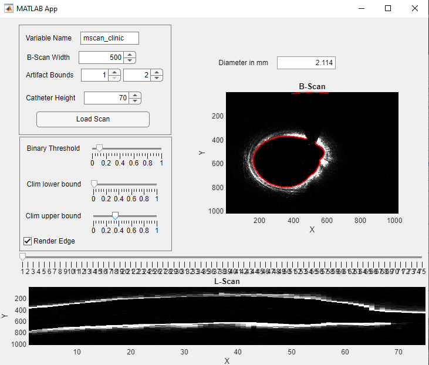

# IVOCT - Thursday Group 1
This document is a short description for all created functions and the general processing chain for the IVOCT-project of Thursday-Group-1.

## Functions
<details>
<summary> <b>denoise</b> </summary>

This function applies a movmean filter to the input image (in polar coordinates).  

__Parameters:__  
| parameter | description                                                                                            |
| --------- | ------------------------------------------------------------------------------------------------------ |
| scanPolar | A polar (B-Scan) image                                                                                 |
| intensity | (optional) The width of the filter window. <br> If not specified, filter with 0.4% of the image width. |

__Output:__  
Image with less noise.

---  

</details>  


<details>
<summary><b> detectedge </b></summary>
Computes an edge (in polar AND cartesian coordinate representation).

__Parameters:__  
| parameter       | description                                                                                                                                    |
| --------------- | ---------------------------------------------------------------------------------------------------------------------------------------------- |
| scanPolar       | B-Scan in polar coordinate representation                                                                                                      |
| binaryThreshold | Threshold for conversion into binary image. <br> All values > binaryThreshold will be converted to 1, all others to 0 (for the edge detection) |

__Output:__  
[edgePolar, edgeCart]  
edgePolar and edgeCart are structures, containing an x array and an y array each (edgePolar.x, etc.). These arrays represent x-y coordinate pairs that represent the detected edge.

---  

</details>


<details>
<summary><b> getbscans </b></summary> 
Splits an M-Scan to multiple (equally-sized) B-Scans of a given width. If the M-Scan width is not divisible by the B-Scan width, the last (not full) image will be dropped.

__Parameters:__  
| parameter  | description                           |
| ---------- | ------------------------------------- |
| mScanPolar | The M-Scan image.                     |
| bScanWidth | Width of the resulting B-Scan images. |

__Output:__  
3-dimensional matrix of size $bScanHeight \times bScanWidth \times bScanCount$.  

---  

</details>


<details>
<summary><b> getcenter </b></summary>
Computes the center of the lumen.  

__Parameters:__  
| parameter | description                                                                              |
| --------- | ---------------------------------------------------------------------------------------- |
| edgeCart  | A detected edge in cartesian coordinate representation. Can be obtained by *detectedge*. |

__Output:__  
*center* structure containing the center-coordinates *center.x* and *center.y*.

---  

</details>

 
<details>
<summary><b> getdiameter </b></summary>
Computes the diameter of the lumen. Uses a mean-value approach on the detected edge in polar coordinate representation.

__Parameters:__  
| parameter | description                                                                         |
| --------- | ----------------------------------------------------------------------------------- |
| edgePolar | A detected edge in polar coordinate representation. Can be obtained by *detectedge* | . |

__Output:__  
*diameter* the diameter of the lumen.

---  

</details>


<details>
<summary><b> getlscan </b></summary>
Computes an L-Scan image.

__Parameters:__  
| parameter  | description                                                                                        |
| ---------- | -------------------------------------------------------------------------------------------------- |
| bScansCart | 3-dimensional array that represents multiple B-Scan images in cartesian coordinate representation. |
| center     | center structure representing the center coordinates of the lumen. Can be obtained by *getcenter*. |

__Output:__  
*lScan* image of size $cartHeight \times scanCount$ representing a cross-section along the blood vessel.

---  

</details>


<details>
<summary><b> loadmscan </b></summary>
Loads the M-Scan data fram a .mat file.  

__Parameters:__  
| parameter    | description                                                                                                                      |
| ------------ | -------------------------------------------------------------------------------------------------------------------------------- |
| filepath     | The name of the .mat file (with either full path or relative path).                                                              |
| variableName | (optional) The name of the variable as defined in the .mat file. Defaults to 'mscancut' (the variable name in phantom1_1_3.mat). |

__Output:__  
*mScan* 2-dimensional array of type double. Represents an M-Scan image. Intensity values are normalized in the interval [0, 1].

---  

</details>


<details>
<summary><b> polartocartesian </b></summary>
Transforms a 2-dimensional image from polar coordinate representation to cartesian coordinate representation.  

__Parameters:__
| parameters | description                                                                       |
| ---------- | --------------------------------------------------------------------------------- |
| scanPolar  | B-Scan image in polar coordinate representation ($polarHeight \times polarWidth$) |

__Output:__  
*scanCart* square B-Scan in cartesian coordinate representation ($cartHeight \times cartWidth = (2*polarHeight+1) \times (2*polarHeight+1)$).

---  

</details>


<details>
<summary><b> removeartifact</b></summary>
Removes the static artifact by interpolation.  

__Parameters:__  
| parameters     | description                                                            |
| -------------- | ---------------------------------------------------------------------- |
| scanPolar      | B-Scan (or M-Scan) in polar coordinate representation.                 |
| artifactBounds | [*lowerBound*, *upperBound*] boundary y-values of the static artifact. |

__Output:__  
B-Scan (or M-Scan) image in polar coordinate representation without the static artifact between the artifact boundary values.  

---  

</details>


<details>
<summary><b> removecatheter </b></summary>
Removes the catheter from a B-Scan (or M-Scan) image in polar coordinate representation.

__Parameters:__  
| parameters     | description                                                        |
| -------------- | ------------------------------------------------------------------ |
| scanPolar      | B-Scan (or M-Scan) in polar coordinate representation.             |
| catheterHeight | The height of the catheter visible in the input image (in pixels). |

__Output:__  
*scanPolar* Polar B-Scan (or M-Scan) image with removed catheter. All pixelvalues with $y <= catheterHeight$ are set to 0.

---  

</details> 

## Processing Chain  
First the M-Scan is loaded with `mScan = loadmscan($FILEPATH, $VARIABLE_NAME)`. Then the catheter and static artifact are removed by using `mScan = removeartifact(mScan, $ARTIFACT_BOUNDS)` and `mScan = removecatheter(mScan, $CATHETER_HEIGHT)` respectively. The next step is to split the M-Scan into an array of multiple B-Scans. This can be achieved with `bScansPolar = getBScans(mScan, $BSCAN_WIDTH)`. Each B-Scan has to be filtered by `denoise`. This can be done by looping through the array of B-Scans:
```matlab
for i = 1:size(bScansPolar, 3)
    bScansPolar(:, :, i) = denoise(bScansPolar(:, :, i)); %uses default intensity for denoise
end
``` 
Now an array for the cartesian images can be initialized. Each B-Scan image should be transformed to cartesian coordinate representation, by using `polartocartesian` and saved to the initialized array.
```matlab
[polarHeight, polarWidth, scanCount] = size(bScansPolar);
bScansCart = zeros([2*polarHeight+1, 2*polarHeight+1, scanCount], "double"); %init
for i = 1:scanCount
    bScansCart(:, :, i) = polartocartesian(bScansPolar(:, :, i)); % transform to cartesian image
end
```
Now the edge, center and diameter can be calculated for any B-Scan. It is neccesary to do it in that order, because `getcenter` and `getdiameter` need the result of `detectedge` to be computed.  
The L-Scan can be computed with `getlscan` from the array of cartesian B-Scans and the calculated center of any B-Scan.
```matlab
bScan = bScansPolar(:, :, $ANY_INDEX); % choose a polar B-Scan
[edgePolar, edgeCart] = detectedge(bScan, $BINARY_THRESHOLD); % detect edge with certain threshold
center = getcenter(edgeCart); % compute center from cartesian edge
diameter = getdiameter(edgePolar); % compute diameter from polar edge
lScan = getlscan(bScansCart, center); % L-Scan that goes through the center of the chosen B-Scan.
```

### Requirements
This processing chain requires some manually defined values to work properly. Some of those could be estimated automatically, but we did not implement that in the scope of this project.
|     variable      |                      description                       | suitable value for "phantom1_1_3.mat" |  suitable value for "mscan_clinic.mat"  |
| :---------------: | :----------------------------------------------------: | :-----------------------------------: | :-------------------------------------: |
|     `$FILEPATH`     | filepath to the .mat file. Might be total or relative. |          "phantom1_1_3.mat"           |           "mscan_clinic.mat"            |
|  `$VARIABLE_NAME`   |            the name of the m-scan variable             |              "mscancut"               |             "mscan_clinic"              |
| `$ARTIFACT_BOUNDS`  |    [lowerBound, upperBound] of the static artifact.    |              [221, 227]               | not needed (might be defined as [1, 2]) |
| `$CATHETER_HEIGHT`  |     max height of the catheter in the polar image      |                 ~102                  |                   ~70                   |
|   `$BSCAN_WIDTH`    |          The width of each polar B-Scan image          |                ~14800                 |                  ~500                   |
| `$BINARY_THRESHOLD` |     threshold for binary values in edge detection      |                 ~0.69                 |                  ~0.15                  |


Those values were determined by __testing__. A better approach would be to automatically compute suitable values for `$ARTIFACT_BOUNDS`, `$CATHETER_HEIGHT`, `$BSCAN_WIDTH` and `$BINARY_THRESHOLD`, or getting those values from user input (for example clicking on certain points in the m-scan image).

## Application  
  
To use the application, enter all values in the upper box (red in the image). Suitable values for the data of our group are given in the table of the [previous section](#requirements). Then push the "Load Scan" button. A file-explorer window will open. Search for your file and open it. The application will load the m-scan data. This might take a while (~30 seconds for "phantom1_1_3.mat" on my machine with Intel Core i7-9750H, 16GB DDR4 RAM).  

All initial values are tweaked for "phantom1_1_3.mat" already. It should be changed for other data.

The values in the green box and the index slider can be tweaked after loading scan data. Changing these sliders updates the output images live. Changing the binary-threshold slider might change the detected edge, so this can be adjusted until the detected edge is (more or less) accurate. Some example values with decent results are given in the table of the [previous section](#requirements) aswell.

### Example for loaded scans
#### phantom1_1_3.mat


#### mscan_clinic.mat

